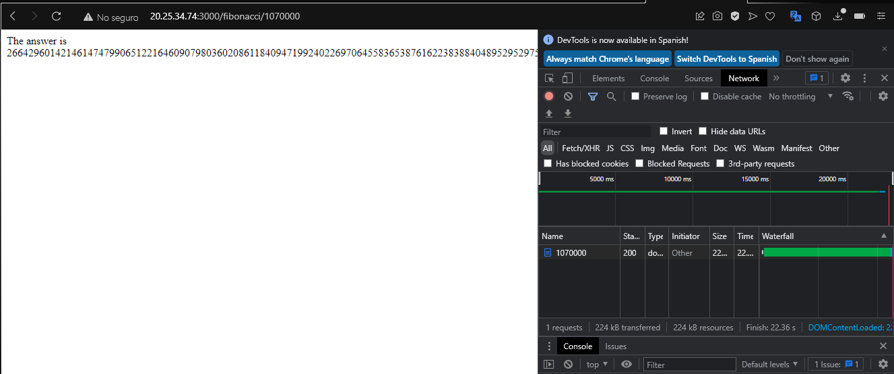

### Escuela Colombiana de Ingeniería
### Arquitecturas de Software - ARSW

## Escalamiento en Azure con Maquinas Virtuales, Sacale Sets y Service Plans

### Dependencias
* Cree una cuenta gratuita dentro de Azure. Para hacerlo puede guiarse de esta [documentación](https://azure.microsoft.com/es-es/free/students/). Al hacerlo usted contará con $100 USD para gastar durante 12 meses.

### Parte 0 - Entendiendo el escenario de calidad

Adjunto a este laboratorio usted podrá encontrar una aplicación totalmente desarrollada que tiene como objetivo calcular el enésimo valor de la secuencia de Fibonnaci.

**Escalabilidad**
Cuando un conjunto de usuarios consulta un enésimo número (superior a 1000000) de la secuencia de Fibonacci de forma concurrente y el sistema se encuentra bajo condiciones normales de operación, todas las peticiones deben ser respondidas y el consumo de CPU del sistema no puede superar el 70%.

### Parte 1 - Escalabilidad vertical

1. Diríjase a el [Portal de Azure](https://portal.azure.com/) y a continuación cree una maquina virtual con las características básicas descritas en la imágen 1 y que corresponden a las siguientes:
    * Resource Group = SCALABILITY_LAB
    * Virtual machine name = VERTICAL-SCALABILITY
    * Image = Ubuntu Server 
    * Size = Standard B1ls
    * Username = scalability_lab
    * SSH publi key = Su llave ssh publica


Procedemos a hacer la creacion de la maquina 


2. Para conectarse a la VM use el siguiente comando, donde las `x` las debe remplazar por la IP de su propia VM (Revise la sección "Connect" de la virtual machine creada para tener una guía más detallada).

    `ssh scalability_lab@xxx.xxx.xxx.xxx`

    

3. Instale node, para ello siga la sección *Installing Node.js and npm using NVM* que encontrará en este [enlace](https://linuxize.com/post/how-to-install-node-js-on-ubuntu-18.04/).

    

    

4. Para instalar la aplicación adjunta al Laboratorio, suba la carpeta `FibonacciApp` a un repositorio al cual tenga acceso y ejecute estos comandos dentro de la VM:

    `git clone <your_repo>`

    `cd <your_repo>/FibonacciApp`

    `npm install`
    
    

5. Para ejecutar la aplicación puede usar el comando `npm FibinacciApp.js`, sin embargo una vez pierda la conexión ssh la aplicación dejará de funcionar. Para evitar ese compartamiento usaremos *forever*. Ejecute los siguientes comando dentro de la VM.

    ` node FibonacciApp.js`

    

    

6. Antes de verificar si el endpoint funciona, en Azure vaya a la sección de *Networking* y cree una *Inbound port rule* tal como se muestra en la imágen. Para verificar que la aplicación funciona, use un browser y user el endpoint `http://xxx.xxx.xxx.xxx:3000/fibonacci/6`. La respuesta debe ser `The answer is 8`.


7. La función que calcula en enésimo número de la secuencia de Fibonacci está muy mal construido y consume bastante CPU para obtener la respuesta. Usando la consola del Browser documente los tiempos de respuesta para dicho endpoint usando los siguintes valores:
    * 1000000

    
    * 1010000

    
    * 1020000

    
    * 1030000

    
    * 1040000

    
    * 1050000

    
    * 1060000

    
    * 1070000

    
    * 1080000

    
    * 1090000

        

8. Dírijase ahora a Azure y verifique el consumo de CPU para la VM. (Los resultados pueden tardar 5 minutos en aparecer).


9. Ahora usaremos Postman para simular una carga concurrente a nuestro sistema. Siga estos pasos.
    * Instale newman con el comando `npm install newman -g`. Para conocer más de Newman consulte el siguiente [enlace](https://learning.getpostman.com/docs/postman/collection-runs/command-line-integration-with-newman/).
    * Diríjase hasta la ruta `FibonacciApp/postman` en una maquina diferente a la VM.
    * Para el archivo `[ARSW_LOAD-BALANCING_AZURE].postman_environment.json` cambie el valor del parámetro `VM1` para que coincida con la IP de su VM.
    * Ejecute el siguiente comando.

    ```
    newman run ARSW_LOAD-BALANCING_AZURE.postman_collection.json -e [ARSW_LOAD-BALANCING_AZURE].postman_environment.json -n 10 &
    newman run ARSW_LOAD-BALANCING_AZURE.postman_collection.json -e [ARSW_LOAD-BALANCING_AZURE].postman_environment.json -n 10
    ```

    
    
    

10. La cantidad de CPU consumida es bastante grande y un conjunto considerable de peticiones concurrentes pueden hacer fallar nuestro servicio. Para solucionarlo usaremos una estrategia de Escalamiento Vertical. En Azure diríjase a la sección *size* y a continuación seleccione el tamaño `B2ms`.


11. Una vez el cambio se vea reflejado, repita el paso 7, 8 y 9.

    * 1000000

    
    * 1010000

    
    * 1020000

    
    * 1030000

    
    * 1040000

    
    * 1050000

    
    * 1060000

    
    * 1070000

    
    * 1080000

    
    * 1090000

        

12. Evalue el escenario de calidad asociado al requerimiento no funcional de escalabilidad y concluya si usando este modelo de escalabilidad logramos cumplirlo.

    Si se cumple con el escenario de calidad de escalabilidad ya que al modificar el tamaño de nuestra maquina modificamos/mejoramos las especificaciones de la VM obteniendo de esta manera mejores tiempos de respuesta y disminuyendo el consumo de CPU de la VM

13. Vuelva a dejar la VM en el tamaño inicial para evitar cobros adicionales.

**Preguntas**

1. ¿Cuántos y cuáles recursos crea Azure junto con la VM?

    Crea 7 recuros:

    - Red Virtual
    - Interfaz de red
    - Maquina Virtual
    - Direccion ip publica
    - Grupo de Seguridad de red
    - Clave SSH
    - Disco
 

2. ¿Brevemente describa para qué sirve cada recurso?

    - Red Virtual: Azure Virtual Network (VNet) es el bloque de creación fundamental de una red privada en Azure. VNet permite muchos tipos de recursos de Azure, como Azure Virtual Machines (máquinas virtuales), para comunicarse de forma segura entre usuarios, con Internet y con las redes locales. VNet es similar a una red tradicional que funcionaría en su propio centro de datos, pero aporta las ventajas adicionales de la infraestructura de Azure, como la escala, la disponibilidad y el aislamiento.

    - Interfaz de red: Una interfaz de red permite que una VM de Azure se comunique con Internet, Azure y recursos locales. Una VM puede tener una o varias interfaces de red.

    - Maquina Virtual: Azure Virtual Machines (VM) es uno de los diversos tipos de recursos informáticos a petición y escalables que ofrece Azure. Por lo general, elegirá una máquina virtual cuando necesite más control sobre su entorno informático del que ofrecen las otras opciones. Una máquina virtual de Azure le ofrece la flexibilidad de la virtualización sin necesidad de adquirir y mantener el hardware físico que la ejecuta. Sin embargo, aún necesita mantener la máquina virtual con tareas como configurar, aplicar revisiones e instalar el software que se ejecuta en ella.

    - Direccion ip publica: Las direcciones IP públicas permiten a los recursos de Internet la comunicación entrante a los recursos de Azure. Permiten que los recursos de Azure se comuniquen con los servicios de Azure orientados al público e Internet. Hasta que cancele la asignación, la dirección estará dedicada al recurso. Un recurso sin una dirección IP pública asignada puede realizar comunicaciones salientes. Azure asigna dinámicamente una dirección IP disponible que no está dedicada al recurso.

    - Grupo de Seguridad de red: Un grupo de seguridad de red (NSG) contiene una lista de reglas de seguridad que permiten o deniegan el tráfico de red a recursos conectados a Azure Virtual Network (VNet). Los NSG se pueden asociar a subredes o a interfaces de red individuales. Un NSG asociado a una interfaz de red se aplica solo a la máquina virtual asociada. Cuando un grupo de seguridad de red está asociado a una subred, las reglas se aplican a todos los recursos conectados a la subred.

    - Clave SSH: SSH es un protocolo de conexión cifrada que permite inicios de sesión seguros a través de conexiones no seguras. SSH es el protocolo de conexión predeterminado de las máquinas virtuales Linux hospedadas en Azure.

    - Disco: Almacenamiento del SO de la maquina virtual

3. ¿Al cerrar la conexión ssh con la VM, por qué se cae la aplicación que ejecutamos con el comando `npm FibonacciApp.js`? ¿Por qué debemos crear un *Inbound port rule* antes de acceder al servicio?

Porque el servicio esta asociado al usuario que realiza la conexion por lo que cuando se cierra la conexion ssh con la VM se cae la aplicación

4. Adjunte tabla de tiempos e interprete por qué la función tarda tando tiempo.

5. Adjunte imágen del consumo de CPU de la VM e interprete por qué la función consume esa cantidad de CPU.

    

    Cada peticion realizada al calculo de la aplicacion representa un uso de CPU por realizar calculos recurrentes que llevan tiempo al no tener concurrencia y memorización.

6. Adjunte la imagen del resumen de la ejecución de Postman. Interprete:
    * Tiempos de ejecución de cada petición.
    * Si hubo fallos documentelos y explique.

    

7. ¿Cuál es la diferencia entre los tamaños `B2ms` y `B1ls` (no solo busque especificaciones de infraestructura)?

| Size             | vCPUs  | RAM (GiB)  |  Data disks| Max IOPS |Temp storage (GiB) | Cost/month |
|------------------|--------|------------|------------|----------|-------------------|------------|
|B1ls              |  1     |0.5         |2           |160       |4                  |3,80 US$    |
|B2ms              |  2     |8           |4           |1920      |16                 |60,74 US$   |

8. ¿Aumentar el tamaño de la VM es una buena solución en este escenario?, ¿Qué pasa con la FibonacciApp cuando cambiamos el tamaño de la VM?

    Es una solucion pero no resuelve todos los problemas ya que permite disminuir el uso de recursos, como el consumo de CPU pero tambien representa mayor costo y el hecho de que la FibonacciApp no esta implementada de la mejor manera.

9. ¿Qué pasa con la infraestructura cuando cambia el tamaño de la VM? ¿Qué efectos negativos implica?

    implica reiniciar la maquina por lo que hay una interrupcion en el servicio que se este prestando.

10. ¿Hubo mejora en el consumo de CPU o en los tiempos de respuesta? Si/No ¿Por qué?

    Si, ya que se cuenta con mas recursos para atender las peticiones.

11. Aumente la cantidad de ejecuciones paralelas del comando de postman a `4`. ¿El comportamiento del sistema es porcentualmente mejor?

    No

### Parte 2 - Escalabilidad horizontal

#### Crear el Balanceador de Carga

Antes de continuar puede eliminar el grupo de recursos anterior para evitar gastos adicionales y realizar la actividad en un grupo de recursos totalmente limpio.

1. El Balanceador de Carga es un recurso fundamental para habilitar la escalabilidad horizontal de nuestro sistema, por eso en este paso cree un balanceador de carga dentro de Azure tal cual como se muestra en la imágen adjunta.


2. A continuación cree un *Backend Pool*, guiese con la siguiente imágen.


3. A continuación cree un *Health Probe*, guiese con la siguiente imágen.


4. A continuación cree un *Load Balancing Rule*, guiese con la siguiente imágen.


5. Cree una *Virtual Network* dentro del grupo de recursos, guiese con la siguiente imágen.


#### Crear las maquinas virtuales (Nodos)

Ahora vamos a crear 3 VMs (VM1, VM2 y VM3) con direcciones IP públicas standar en 3 diferentes zonas de disponibilidad. Después las agregaremos al balanceador de carga.

1. En la configuración básica de la VM guíese por la siguiente imágen. Es importante que se fije en la "Avaiability Zone", donde la VM1 será 1, la VM2 será 2 y la VM3 será 3.


2. En la configuración de networking, verifique que se ha seleccionado la *Virtual Network*  y la *Subnet* creadas anteriormente. Adicionalmente asigne una IP pública y no olvide habilitar la redundancia de zona.


3. Para el Network Security Group seleccione "avanzado" y realice la siguiente configuración. No olvide crear un *Inbound Rule*, en el cual habilite el tráfico por el puerto 3000. Cuando cree la VM2 y la VM3, no necesita volver a crear el *Network Security Group*, sino que puede seleccionar el anteriormente creado.


4. Ahora asignaremos esta VM a nuestro balanceador de carga, para ello siga la configuración de la siguiente imágen.


5. Finalmente debemos instalar la aplicación de Fibonacci en la VM. para ello puede ejecutar el conjunto de los siguientes comandos, cambiando el nombre de la VM por el correcto

```
git clone https://github.com/daprieto1/ARSW_LOAD-BALANCING_AZURE.git

curl -o- https://raw.githubusercontent.com/creationix/nvm/v0.34.0/install.sh | bash
source /home/vm1/.bashrc
nvm install node

cd ARSW_LOAD-BALANCING_AZURE/FibonacciApp
npm install

npm install forever -g
forever start FibonacciApp.js
```

Realice este proceso para las 3 VMs, por ahora lo haremos a mano una por una, sin embargo es importante que usted sepa que existen herramientas para aumatizar este proceso, entre ellas encontramos Azure Resource Manager, OsDisk Images, Terraform con Vagrant y Paker, Puppet, Ansible entre otras.

#### Probar el resultado final de nuestra infraestructura

1. Porsupuesto el endpoint de acceso a nuestro sistema será la IP pública del balanceador de carga, primero verifiquemos que los servicios básicos están funcionando, consuma los siguientes recursos:

```
http://52.155.223.248/
http://52.155.223.248/fibonacci/1
```

2. Realice las pruebas de carga con `newman` que se realizaron en la parte 1 y haga un informe comparativo donde contraste: tiempos de respuesta, cantidad de peticiones respondidas con éxito, costos de las 2 infraestrucruras, es decir, la que desarrollamos con balanceo de carga horizontal y la que se hizo con una maquina virtual escalada.

3. Agregue una 4 maquina virtual y realice las pruebas de newman, pero esta vez no lance 2 peticiones en paralelo, sino que incrementelo a 4. Haga un informe donde presente el comportamiento de la CPU de las 4 VM y explique porque la tasa de éxito de las peticiones aumento con este estilo de escalabilidad.

```
newman run ARSW_LOAD-BALANCING_AZURE.postman_collection.json -e [ARSW_LOAD-BALANCING_AZURE].postman_environment.json -n 10 &
newman run ARSW_LOAD-BALANCING_AZURE.postman_collection.json -e [ARSW_LOAD-BALANCING_AZURE].postman_environment.json -n 10 &
newman run ARSW_LOAD-BALANCING_AZURE.postman_collection.json -e [ARSW_LOAD-BALANCING_AZURE].postman_environment.json -n 10 &
newman run ARSW_LOAD-BALANCING_AZURE.postman_collection.json -e [ARSW_LOAD-BALANCING_AZURE].postman_environment.json -n 10
```

**Preguntas**

* ¿Cuáles son los tipos de balanceadores de carga en Azure y en qué se diferencian?, ¿Qué es SKU, qué tipos hay y en qué se diferencian?, ¿Por qué el balanceador de carga necesita una IP pública?

    Los balanceadores de carga de Azure vienen en dos variedades. Hay balanceadores de carga públicos y balanceadores de carga internos, que también se conocen como balanceadores de carga privados.

    Un equilibrador de carga público se usa cuando necesita equilibrar la carga del tráfico de Internet entrante a sus máquinas virtuales. Este tipo de balanceador de carga requiere que asigne una dirección IP pública a la interfaz del balanceador de carga. También es importante tener en cuenta que los balanceadores de carga públicos pueden proporcionar conexiones salientes a Internet para máquinas virtuales que se encuentran dentro de su red virtual de Azure. Para que esto suceda, lo que hacen los balanceadores de carga públicos es traducir las direcciones IP privadas de las máquinas virtuales a direcciones IP públicas. Esto les permite comunicarse externamente aunque las propias máquinas virtuales no tengan direcciones IP públicas.

    Los balanceadores de carga internos se pueden usar en situaciones en las que solo se requieren direcciones IP privadas en la interfaz. Esto significa que los balanceadores de carga internos están limitados a casos de uso en los que solo necesita equilibrar la carga del tráfico dentro de su red virtual de Azure o desde una red local que se ha conectado a su red virtual a través de una conexión VPN o ExpressRoute.

    * SKU (Stock Keeping Unit) Representa una unidad de mantenimiento de existencias, lo cual significa que es un codigo unico asignado a un servicio o producto de Azure, el cual nos permite a nosotros como usuarios la posibilidad de comprar existencias de los mismos.

        - Basico: Equipado para aplicaciones a pequeña escala que no necesitan alta disponibilidad ni redundancia. No es compatible con las zonas de disponibilidad. Admite hasta 200 configuraciones.
        - Estandar: Equipado para el tráfico de la capa de red de equilibrio de carga cuando se necesitan un alto rendimiento y una latencia muy baja. Enruta el tráfico dentro y entre regiones, y a zonas de disponibilidad para lograr una alta resistencia. Admite hasta 600 configuraciones.
        - Premium: Los registros premium brindan la mayor cantidad de almacenamiento incluido y operaciones simultáneas, lo que permite escenarios de gran volumen. Además de un mayor rendimiento de imágenes, Premium agrega funciones como la replicación geográfica para administrar un registro único en varias regiones, confianza en el contenido para la firma de etiquetas de imágenes, enlace privado con puntos finales privados para restringir el acceso al registro.
        

* ¿Cuál es el propósito del *Backend Pool*?

    Define el grupo de recursos que atenderán el tráfico para una regla de equilibrio de carga determinada.

* ¿Cuál es el propósito del *Health Probe*?

     La configuración del sondeo de estado y las respuestas del sondeo determina qué instancias del grupo de back-end recibirán nuevas conexiones. Utilice sondeos de estado para detectar el error de una aplicación. Genere una respuesta personalizada a un sondeo de estado. Use la sonda de estado para el control de flujo para administrar la carga o el tiempo de inactividad planificado. Cuando falla un sondeo de estado, el balanceador de carga dejará de enviar nuevas conexiones a la respectiva instancia en mal estado. La conectividad saliente no se ve afectada, solo la entrante. Las sondas de estado admiten varios protocolos. La disponibilidad de un protocolo de sondeo de estado específico varía según la SKU de Load Balancer. 

* ¿Cuál es el propósito de la *Load Balancing Rule*? ¿Qué tipos de sesión persistente existen, por qué esto es importante y cómo puede afectar la escalabilidad del sistema?.

    Se usa una regla de equilibrador de carga para definir cómo se distribuye el tráfico entrante a todas las instancias dentro del grupo de back-end. Una regla de equilibrio de carga asigna una configuración de IP y un puerto front-end determinados a varias direcciones IP y puertos de back-end. Un ejemplo sería una regla creada en el puerto 80 para equilibrar la carga del tráfico web.    

* ¿Qué es una *Virtual Network*? ¿Qué es una *Subnet*? ¿Para qué sirven los *address space* y *address range*?

    Es el componente fundamental de su red privada en Azure. VNet permite que muchos tipos de recursos de Azure, como Azure Virtual Machines (VM), se comuniquen de forma segura entre sí, Internet y las redes locales. VNet es similar a una red tradicional que operaría en su propio centro de datos, pero trae consigo beneficios adicionales de la infraestructura de Azure, como escala, disponibilidad y aislamiento.

    Subnet - Todos los recursos de Azure implementados en una red virtual se implementan en una subred dentro de una red virtual. las subredes le permiten segmentar la red virtual en una o más subredes y asignar una parte del espacio de direcciones de la red virtual a cada subred.

    address space - Al crear una red virtual, debe especificar un espacio de direcciones IP privado personalizado mediante direcciones públicas y privadas (RFC 1918). Azure asigna a los recursos de una red virtual una dirección IP privada desde el espacio de direcciones que usted asigne. Por ejemplo, si implementa una máquina virtual en una red virtual con espacio de direcciones, 10.0.0.0/16, a la máquina virtual se le asignará una IP privada como 10.0.0.4.

    addres range - El rango debe estar dentro del espacio de direcciones que ingresó para la red virtual. El rango más pequeño que puede especificar es /29, que proporciona ocho direcciones IP para la subred. Azure reserva la primera y la última dirección de cada subred para la conformidad con el protocolo. Se reservan tres direcciones adicionales para el uso del servicio de Azure. Como resultado, una red virtual con un rango de direcciones de subred de /29 solo tiene tres direcciones IP utilizables.

* ¿Qué son las *Availability Zone* y por qué seleccionamos 3 diferentes zonas?. ¿Qué significa que una IP sea *zone-redundant*?

    Las zonas de disponibilidad de Azure son ubicaciones separadas físicamente dentro de cada región de Azure que toleran errores locales. Las fallas pueden variar desde fallas de software y hardware hasta eventos como terremotos, inundaciones e incendios. La tolerancia a los errores se logra gracias a la redundancia y el aislamiento lógico de los servicios de Azure. Para garantizar la resiliencia, hay un mínimo de tres zonas de disponibilidad separadas en todas las regiones habilitadas para zonas de disponibilidad.

    Las zonas de disponibilidad están diseñadas para que, si una zona se ve afectada, las dos zonas restantes admitan los servicios regionales, la capacidad y la alta disponibilidad.

    zone redundant - con replicación automática entre zonas, o zonales, con instancias ancladas a una zona específica.

* ¿Cuál es el propósito del *Network Security Group*?

     filtrar el tráfico de red hacia y desde los recursos de Azure en una red virtual de Azure. Un grupo de seguridad de red contiene reglas de seguridad que permiten o deniegan el tráfico de red entrante o el tráfico de red saliente desde varios tipos de recursos de Azure. Para cada regla, puede especificar el origen y el destino, el puerto y el protocolo.

* Informe de newman 1 (Punto 2)

    

* Presente el Diagrama de Despliegue de la solución.

    


